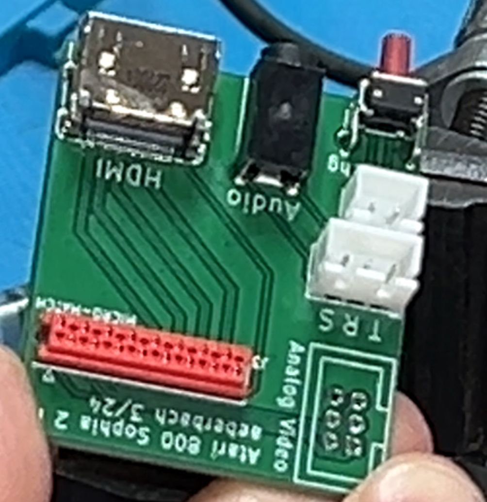

This is the HDMI output PCB that I designed to replace the DVI daughterboard supplied with the amazing [Sophia 2 by Simius](https://forums.atariage.com/topic/307175-sophia-2-improved-gtia-replacement/#comment-4544874)

